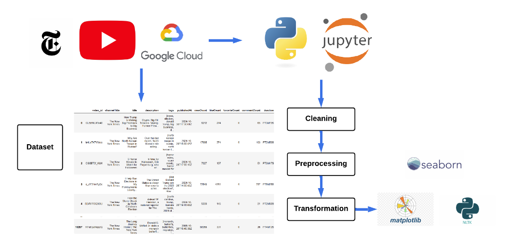
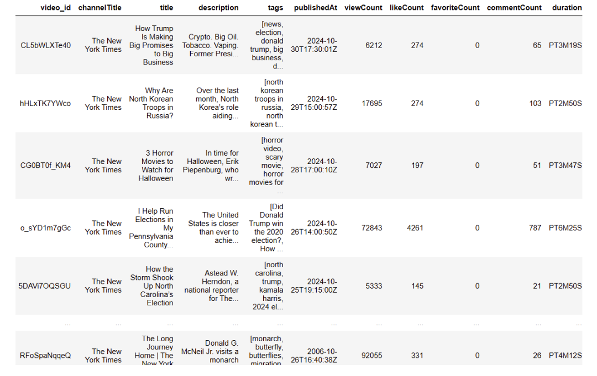
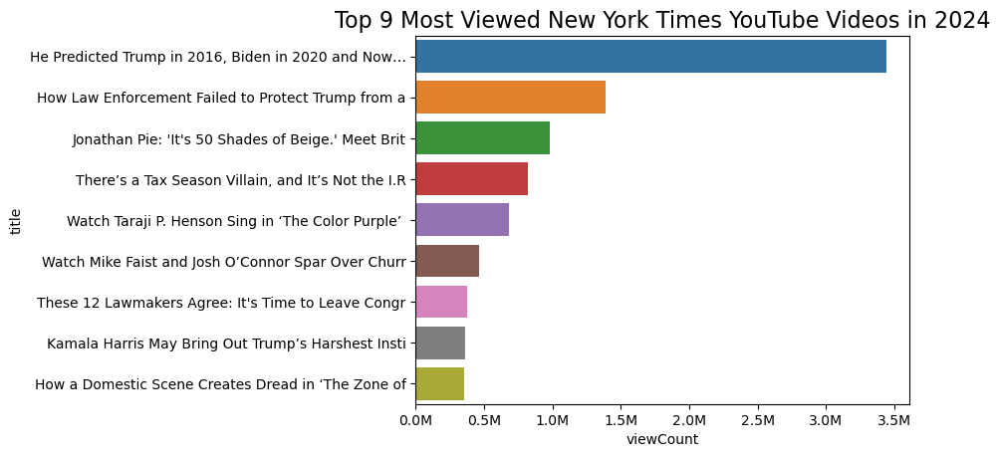
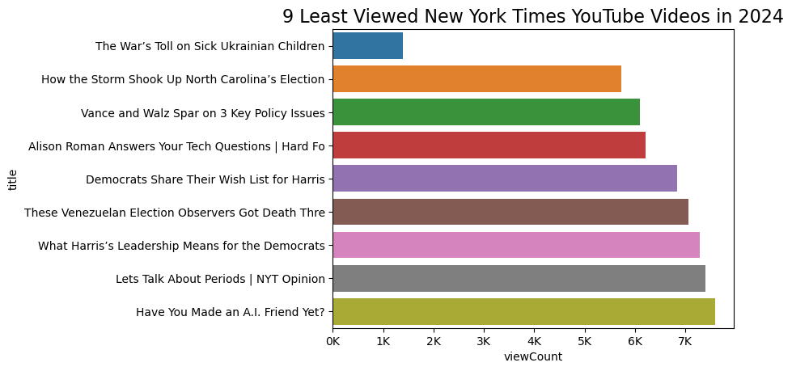
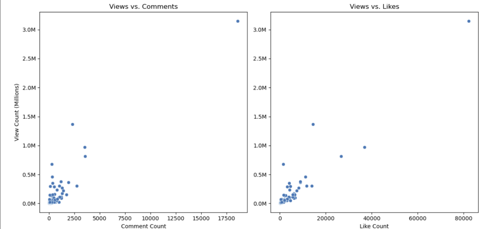
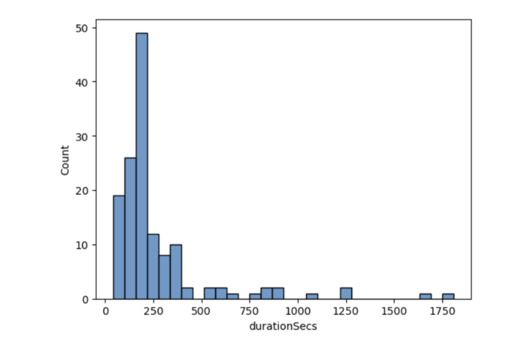
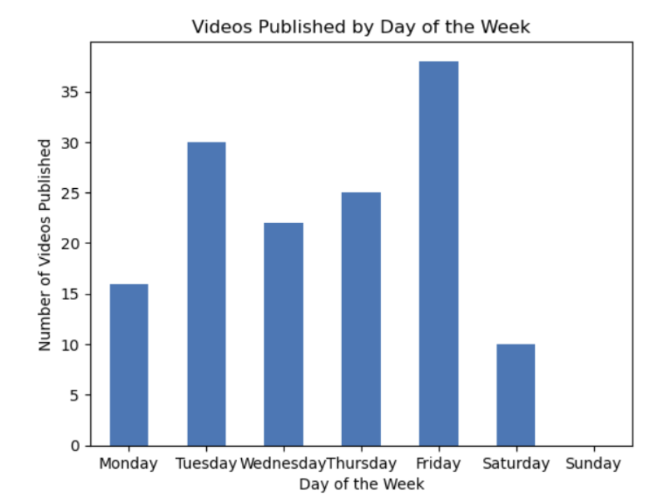

## Youtube Engagement Metrics for The New York Times :newspaper:
By Gabriela Sanchez 

Fall 2024

Updated November 2024

## Project Tools :wrench:

**Project goal:**  The goal of this project is to obtain data about all the YouTube videos from the New York Times channel using an API Key to visualize their most recent topics in 2024. In addition, it measures the performance of the most watched videos and their worst-performing videos during this year. 

**Key insights:** The analysis reveals recent topics covered by The New York Times YouTube channel, including the U.S. presidential debate, the upcoming presidential election, and the Middle Eastern conflict. It also highlights the channel's average video duration and top-performing videos of 2024.

**Tools:** Python, Google Cloud, Google API Client, Youtube, Matplotlib, Seaborn, Pandas

**Concepts:** YouTube API for Python, Channel Statistics, Exploratory Data Analysis, Natural Language Toolkit

## Project Objectives :dart:

The New York Times (NYT) was founded in 1851 with a mission to provide the public with accurate and reliable news.  In the late 1990s and early 2000s, the NYT began to expand its online presence, launching its website and investing in digital journalism. For my project, I aim to gather data on all the YouTube videos from the New York Times channel using an API Key, focusing on their most recent topics in 2024. I’ll also analyze the performance of their most-watched and lowest-performing videos this year to gain insights into what resonates with viewers.

&nbsp;&nbsp;
## Datasets

This project utilizes the following datasets:

- **NYT YouTube Video Data**: This dataset contains information on all videos posted by the New York Times on their YouTube channel in 2024. It includes metrics such as views, likes, comments, and publication dates.

### Dataset Format
This dataset contains details about YouTube videos posted by The New York Times in 2024, capturing key metrics like views, likes, comments, and publication dates. Each entry includes metadata (e.g., video ID, title, description, and tags), engagement metrics (viewCount, likeCount, commentCount), and specific video details, such as duration, video definition (e.g., HD), and whether captions are available. This dataset provides a clear snapshot of content performance and viewer engagement, useful for analyzing video trends and audience interests.

The data is stored in a CSV file with the following columns:
- `video_id`: Unique identifier for each Youtube video
- `channelTitle`: Name of the Youtube channel
- `title`: Title of the Youtube video
- `description`: Description of the Youtube video
- `tags`: Tags of Youtube video
- `publishedAt`: Date when the video was published
-  `viewCount`: Number of Views
-  `likeCount`: Number of Likes
-  `commentCount`: Number of comments
-  `duration`: Duration of video in minutes and seconds
-  `definition`: Video definition
-  `caption`: Indicates whether the video has captions (True or False )

&nbsp;&nbsp;
## Project Workflow :rocket:

For a closer look at the ETL process, please take a look at the [Python code](nyt_youtube_api_project.ipynb) attached to this repository.

&nbsp;&nbsp;
## Data Extraction

To obtain the dataset it was necessary to obtain an API Key from Google Cloud. Please take a look at the [Python code](nyt_youtube_api_project.ipynb) attached to this repository. After initializing the API Key, I could build a function using API request and obtaining the channel stats of each channel id, in this case, it was only The New York Times.

After retrieving the channel ID of The New York Times from YouTube, it was necessary to create a function to extract statistics from each video in the YouTube channel.

This is the output:

&nbsp;&nbsp;
## Visualizations in Python &nbsp;&nbsp;
&nbsp;&nbsp;
### Bar Plot: Best Performing Videos
&nbsp;&nbsp;

**Insights:** 
- In 2024, the most engaging video on the New York Times YouTube channel was uploaded in September and focused on predictions for the upcoming presidential elections. It achieved over 3 million views and received more than 18,000 comments.
  
&nbsp;&nbsp;
### Bar Plot: Least Viewed Videos
&nbsp;&nbsp;

**Insights:** 
- In 2024, the least viewed videos reached less than 10,000 views and less engaging comments. The video about how Hurricane Helene reshaped North Carolina elections reached less than 6,000 views.
  
&nbsp;&nbsp;
### Scatter Plot: Plotting Views vs. Comments and Views vs. Likes
&nbsp;&nbsp;

**Insights:**
- Videos that generate more views can also lead to increased discussions and comments. These visualizations demonstrate videos that attract more viewers tend to receive more likes. As viewers engage with a video, they are often motivated to express their opinions or ask questions, resulting in a higher number of comments.
  
&nbsp;&nbsp;
### Histogram: Video Duration
&nbsp;&nbsp;

**Insights:**
- On The New York Times YouTube channel, video duration averages around 3 minutes, though many videos on the platform extend beyond 10 minutes.

&nbsp;&nbsp;
### WordCloud: Trending Topics on The NYT Youtube Channel
&nbsp;&nbsp;

**Insights:**
- In 2024, key topics of discussion included the U.S. presidential elections, with a focus on political figures like Kamala Harris, Joe Biden, and Donald Trump. Additionally, global conflicts such as the Middle East crisis and natural disasters like Hurricane Helene were significant subjects of conversation.
  
&nbsp;&nbsp;
### Upload Schedule
&nbsp;&nbsp;

**Insights:**
- The majority of videos published on The New York Times YouTube channel are released on Tuesdays, Thursdays, and Fridays.
  
&nbsp;&nbsp;
## Key insights :bulb:

- From January to October of 2024 The New York Times Youtube Channel has uploaded 142 videos. Their consistency in uploading their videos has allowed the newspaper to actively engage with followers.
  
- The New York Times is an American daily newspaper, and its recent uploads showcase topics of interest to Americans, including the presidential elections, current political issues with the government, and key candidates such as Kamala Harris and Donald Trump. Additionally, frequent tags like 'Gaza' highlight ongoing discussions about world conflicts in the Middle East.
  
- Most of the videos published in the New York Times Youtube Channel are short lasting only 3 minutes on average.

- By October 2024, the channel’s top videos reached over 500,000 views. The most engaging video exceeded three million views and focused on the upcoming presidential elections.
  
&nbsp;&nbsp;
## Conclusions :mag_right:

- The New York Times strives to set a standard for innovative storytelling across its news coverage and investigations. It addresses a wide array of topics, including national and international news, politics, business, technology, arts, and lifestyle.
  
- As 2024 is still underway, there remains potential for the channel to create even more engaging videos for its audience, particularly as this year marks a significant political transition in the United States.

- Visual tools like word clouds can be highly effective for content analysis, providing insights into emerging trends related to specific topics or events. In this analysis, one can observe how particular subjects in U.S. news gain relevance over time.
  
- Consistency is essential for a YouTube channel to drive engagement across all digital platforms. The data presented in the charts shows that videos with the highest number of views often generate more comments and likes. While not every video may achieve significant views, a consistent posting strategy helps build a community that attracts users to the platform, ultimately enhancing overall engagement.
